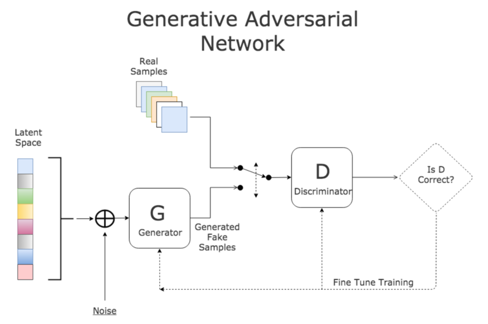
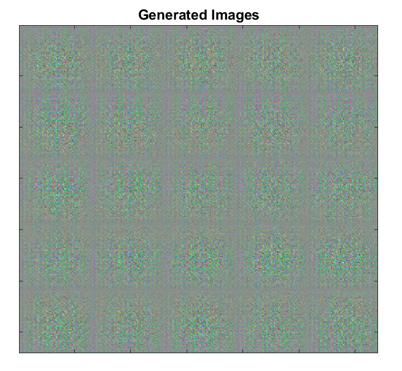
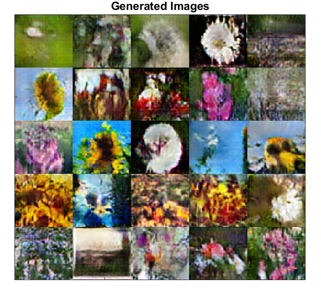

## Table of contents
 - [Introduction](#i-think-i-might-be-loosing-my-sanity-because)
 - [What is Gan](#what-is-gan)
 - [Projects]():
   * [Simple GAN](https://github.com/Fakser/Matlab-GANs/tree/main/Simple%20GAN)

## I think I might be loosing my sanity because
because I am starting to love matlab the same way my lecturers do. I have been always 
wondering why every person on my university is coming down over this software. It looks like it looks,
strange, dirty. Well, stupid I've been. Matlab is one awful beast. But if thou have sanity to control it,
would thou possess such enormus power, that the whole universe would tremble under thy feet. 

## What is GAN

A generative adversarial network (GAN) is a class of machine learning algorithm designed for the purouse of generating stuff. Two neural networks contest with each other in a game (in the form of a zero-sum game, where one agent's gain is another agent's loss). 

Given a training set, this technique learns to generate new data with the same statistics as the training set. For example, a GAN trained on photographs can generate new photographs that look at least superficially authentic to human observers, having many realistic characteristics. Though originally proposed as a form of generative model for unsupervised learning, GANs have also proven useful for semi-supervised learning, fully supervised learning, and reinforcement learning. 
 
The core idea of a GAN is based on the "indirect" training through the discriminator, which itself is also being updated dynamically. This basically means that the generator is not trained to minimize the distance to a specific image, but rather to fool the discriminator. This enables the model to learn in an unsupervised manner. 

Simple example of GAN training procedure on Iris dataset: 
We start with random noise: 
 
After many iterations our GAN will get better at generating pictures: 
 
